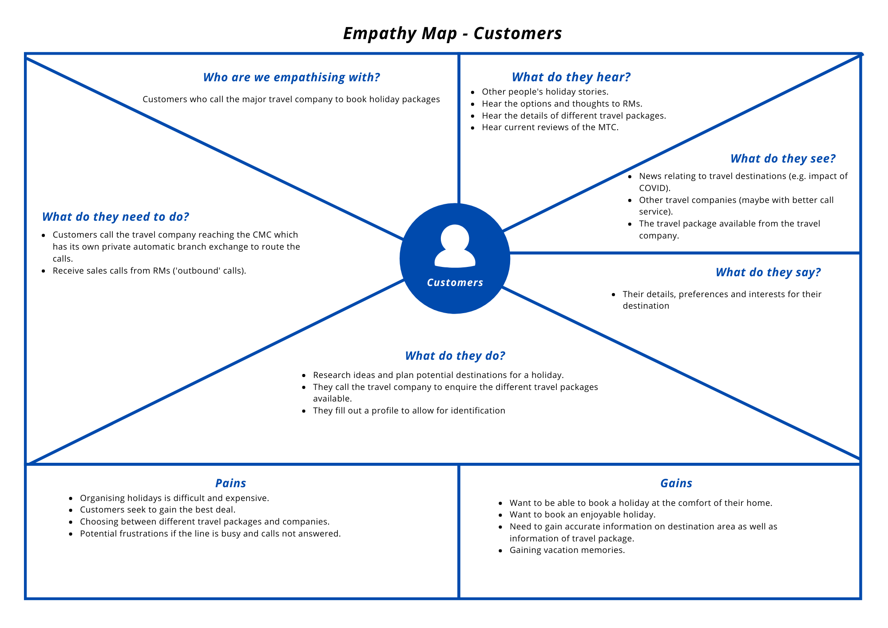
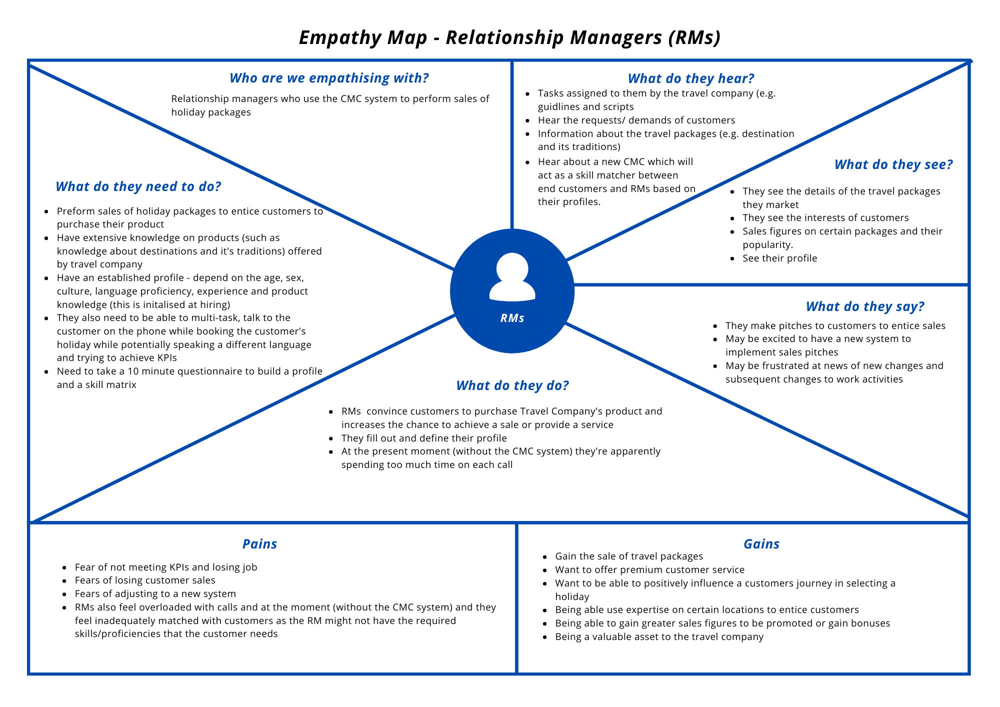
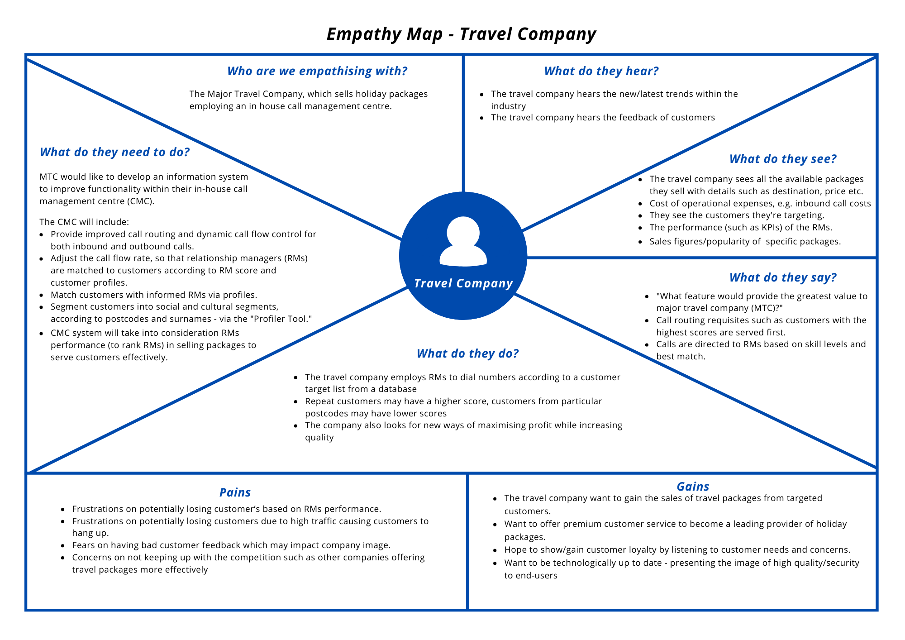
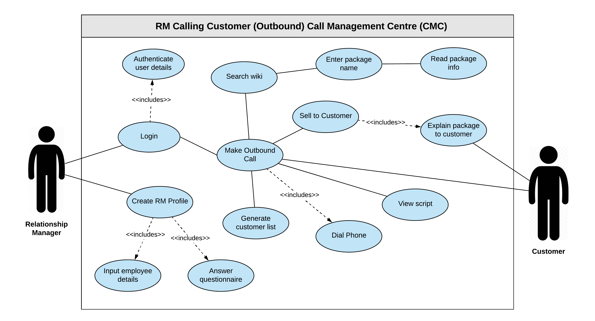
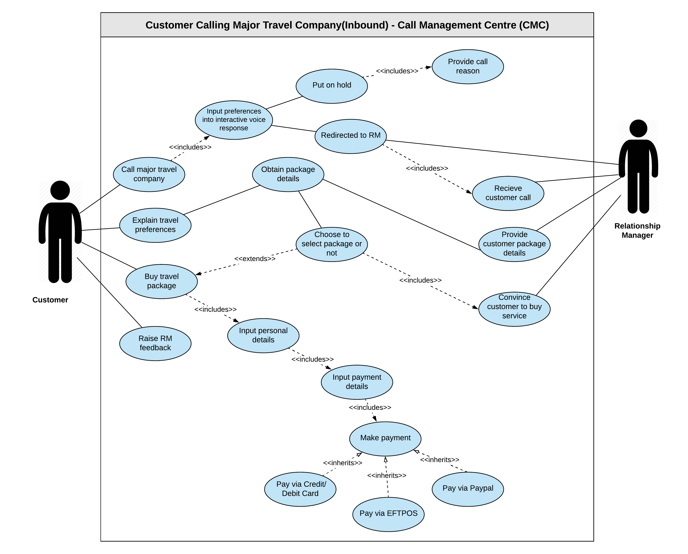
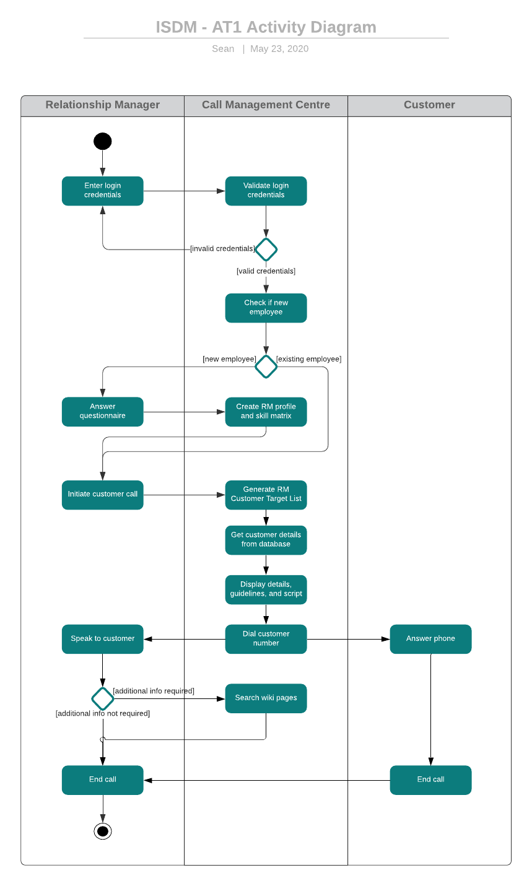
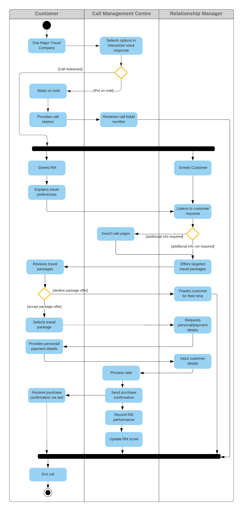
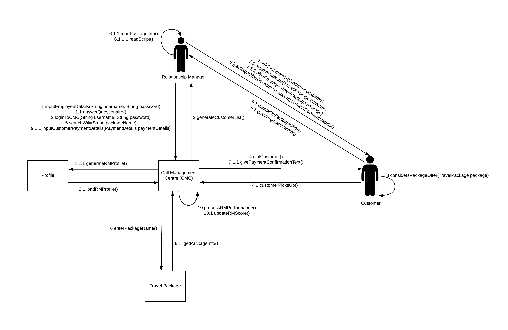
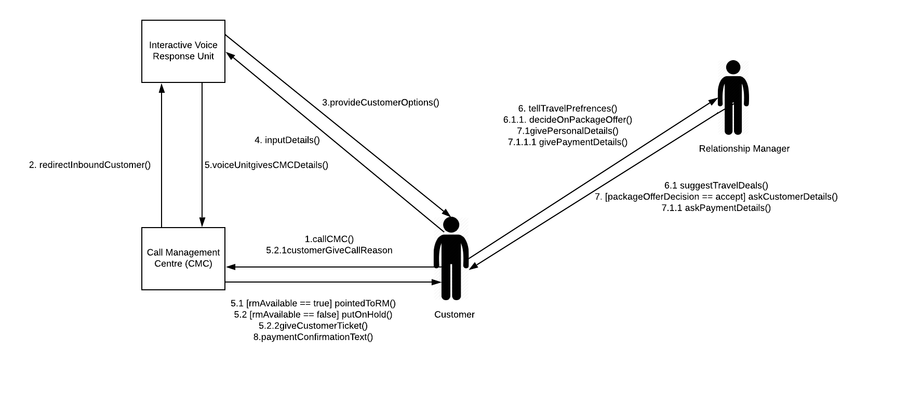

# **31257 Information System Development Methodologies - Project Report**

Executive Summary
=================
This report presents the definition, analysis, and design of an improved information system (IS) solution for the call management centre (CMC) of a major travel company. Design Thinking principles and agile methodology (Scrum) used are discussed, and iterative progress is documented on GitHub. The process of identifying and empathised with stakeholders assisted the definition of relevant problems and objectives. This, in addition to certain assumptions made, helped inform the ideation process - the results of which were then modelled in various diagrams. The potential advantages and negative outcomes of the new IS are then discussed.

Link to GitHub repository: [Tutorial10_Group-1](https://github.com/zacaz90/Tutorial10_Group-1)

Link to Presentation: [Group 1 ISDM Presentation](https://youtu.be/HOksut2P2MQ)

Problem Definition
==================
Customer experience is heavily impacted because of the call flow rate in the (CMC), as customers are not being assigned to well informed RMs that have the most appropriate knowledge about that particular holiday destination and its traditions i.e. their skillset. This, in turn, is impacting RMs performance in selling packages and serving customers effectively and efficiently.  

There is also no defined guideline for RMs to approach outbound calls, which affects the service provided to the end customer. High costs associated with inbound calls from customers due to the per-call handling time is also of concern. 

Furthermore, a key issue faced by customers is waiting times during busy times. This can have a negative impact on the major travel company’s brand and make them potentially lose customers. 

## **Objectives**

This project is designed to help the major travel company develop an information system to improve the functionality of their in-house Call Management Centre. This is done by adjusting the call flow rate to match customers to a suitable relationship manager, based on their skillset, product knowledge and profile. The aim is to improve the customer experience and satisfaction. Ultimately the objective is to increase the sales of holiday packages adding to the profitability and provide better assistance to relationship managers performing sales.

## **Assumptions**
In the duration of this project the following assumptions were considered in all system analysis and feature recommendations. 

* The CMC has enough processing power to handle complex computations and algorithms.
* The CMC is already equipped with all data with information such as a customer database with information such as postcodes and surnames.
* Employee’s within Major Travel Company have appropriate product knowledge and understanding of the operations within the CMC.
* The functionality of the inbuilt profiler tool includes customer profile generation and allows the CMC to auto-generate a generic list of customers for specified Relationship Managers (RMs).
* The details elicited from the RM questionnaire includes RM’s age, sex, culture, language proficiency, experience and product knowledge. 
* The CMC autogenerates generic scripts and guidelines to assist RM sales.
* The current interactive response unit has limited functionality to ensure customer retention with no hold music or ticketing system during peak traffic. 

## **List of Stakeholders**
Stakeholders refer to individuals/entities that have an interest in the development of an information system. The key stakeholders of this project are:

* **Customers** - explore and purchase holiday packages from the travel company via the CMC
* **Relationship Managers (RMs)** - perform sales of holiday packages through inbound/outbound customer calls
* **Major Travel Company (MTC)** - attempts to make profit utilising the CMC to sell holiday packages, controls key business functions (e.g. operational expenses, human resources)

## **Point of View (POV) Statements**
### Customers
* Customers calling the travel company need to  have their call answered in a timely manner because currently, customers must wait on the phone with no RM callback
* Customers speaking to a Relationship Manager need to be matched with an RM who has the required language proficiency because currently, customers are being inadequately paired with RMs who do not meet skill/language requirements
* Customers with little travelling experience need to call capable/experienced RMs because currently, some customers are finding imperfect packages due to inadequate RM matching

### Travel Company
* Travel Company managing RM staff needs to determine which staff members are underperforming (reaching KPIs) because currently, there is no system with KPI tracking capabilities
* Travel Company need to manage incoming calls so that additional call costs do not impact company budget because the current system does not effectively manage incoming calls (without unforeseen impacts to potential end-users)
* Travel Company managing customer relations needs to improve CMC operation and call flow rate because currently, customers are complaining about wait times
* Travel Company managing customer relations needs to profile RMs because RMs are not matched effectively with customers being served

### Relationship Managers
* Relationship Managers need to serve customers that match their skill set and knowledge because currently, some RMs do not have the required knowledge to best serve calling customers
* Relationship Managers need the system to provide guidelines/script for outbound calls to ensure high-quality customer service because currently, there is no defined way to approach these calls
* Relationship Managers need to have an established profile (depending on the age, sex, culture, language proficiency, experience and product knowledge) because currently, customers are allocated based only on RM’s expertise

## **Empathy Maps**
Empathy maps help immerse us in our stakeholders' environment in order to better understand them. The empathy map for customers, relationship managers and the major travel company, in order, follow:
### Empathy Map - Customers

### Empathy Map - Relationship Managers

### Empathy Map - Travel Company

Design Thinking Approach
========================
## **Approach - Design Thinking**
Design thinking is a non-linear, iterative process which seeks the understanding of users to redefine problems and create innovative solutions to prototype and test. This customer-centric approach was undertaken to address the improvements requested by the Major Travel Company for their Call Management Centre (CMC). The design thinking approach consists of the following five phases:

### Empathise
Phase one consisted of empathising with stakeholders. Empathy is a crucial step in achieving a human-centred design process and was utilised to gain insight into users and their needs without imposing bias. When we create solutions, we get better solutions when we think of those who will be affected. To document these perspectives, empathy maps were utilised to visualise and share our understanding of stakeholders needs and aid future decision making. Phase one allowed us to gain a deeper understanding of the perspective of the users involved and how to shape our solution.

### Define
Phase two consisted of synthesising the knowledge obtained in the empathise stage and defining core problems to solve. Here the problem statements were directly derived from creating point of view (POV) statements for all the stakeholders identified. This stage allowed us as a team to consolidate assumptions and agree on features to be developed to solve the problem given.

### Ideate
Phase three consisted of utilising user research obtained to ideate solutions to the problem statements created in the prior stage. Brainstorming and 'worst possible idea' techniques were utilised. These techniques helped initiate free-form group discussions and stimulate creative solutions. Ideate sessions consisted of developing “how might we?" (HMW) statements and deriving features relative to the point of view statements developed. At the conclusion of this stage, the agreed-upon features were documented and converted to issues in GitHub to be developed for the prototype and testing stage.

### Prototype/Test
The prototype and testing phases represent the final stages within the design thinking approach. This consists of producing mock-ups of the product or specific features so that tangible investigations can occur on the solutions generated in the previous stage. Due to the nature of this project, the prototype and respective testing are not within scope. However, to assist in the prototype stage the team designed artefacts representative of the design of the system such as use case, activity, class and collaboration diagrams. 

### Artefacts
Artefact | Description
---|---
Empathy Maps | Empathy Maps are used to visualise user attitudes and behaviours. This map is split into 6 quadrants (Says, Thinks, Does, Feels, Pains and Gains).
Point of view statements (POV) | POV statements focuses on the specific user and their needs. These statements represent the team’s results for the define phase.
How might we? (HMW) | HMW statements represent the results of the ideate phase and are short statements built from point of view statements

## **Brainstormed Ideas and Reflection**
The following features were concluded from the brainstorming session. 
Feature | Justification
--- | ---
Enhance Interactive Voice Response unit | Helps understand initial customer needs without an in-person RM answering the call.
Improve RM questionnaire  | Allows better initial classification of the RM by providing more parameters for the CMC to score by.
Added internal wiki of further package information | Allows all RMs to be confident in all packages by providing package information
Feedback tool implemented  | Allows the CMC to implement RM scoring in real-time after the call is undertaken.
Enhanced RM guidelines  | Embeds natural language processing in the CMC to enhance the autogenerated RM scripts to enhance sale chances. 

The biggest issue we, as a group, faced over the course of our project was our unfamiliarity with GitHub. This took out a portion of each group meeting, as we struggled to figure out a consistent workflow. Furthermore, the lack of face-to-face communication was a great inconvenience, especially in relation to filming and editing the presentation.

## **How Might We (HMW) Statements**
### End-Customer
* HMW better reach customers who have been on hold for an extended period of time.
* HMW better match customers to RMs so they have a high quality of customer service.
* HMW better match RMs with customers so they can find perfect packages.
* HMW prevent customers from hanging up.
* HMW better communicate with customers to lock down deals within a minimal call time.

### Relationship Managers
* HMW profile RMs, so they are matched effectively to customers served.
* HMW match more knowledgeable RMs to specific customers.
* HMW better allocate customers based on RM expertise

### Travel Company
* HMW monitor KPIs.
* HMW manage incoming calls so that they do not add additional costs to the travel company by occupying human resources (Relationship Managers).

## **Agile Methodology - Scrum**
The Scrum framework encourages iterative development/review of requirements allowing for greater adaptability to changes in client needs, technological advancements, and other environmental factors (e.g. global pandemics).

### Roles
This project required the product owner and scrum master to double as development team members.

Role | Team Member | Responsibilities
--- | --- | ---
Product Owner | Zac | Defines, prioritises, communicates, and monitors the product vision.
Scrum Master | Aiswarya | Facilitates scrum team events and promotes scrum principles.
Development team | Anastasia, Sanya, Sean | Builds/delivers working increment of the product every sprint.

### Events/Activities
A sprint is a fixed period of time after which a deliverable iteration of a product must be developed. The following activities were conducted in each sprint (Sunday to Friday).

Event | Description
--- | ---
Sprint Planning | On the first day of each sprint, backlog tasks/goals for the current sprint were established, reviewed, and assigned. Relevant tasks were moved to “Ready for dev” on the project board.
Sprint Review | Every Friday, the development team delivered their work for the sprint. Progress and tasks left to complete were evaluated.
Sprint Retrospective | After sprint reviews, we re-evaluated and improved our workflow, communication, and other issues from the sprint.
Daily Scrum | Each day, progress updates/issues were discussed and resolved. This was agreed to be communicated over text due to clashing schedules.

### Artefacts
Artefact | Description
---|---
Product Backlog | Prioritised list of all requirements for a product.
Sprint Backlog | Subset of the Product Backlog for development during a sprint.
Product Increment | Potentially shippable version of the product built each sprint.
Sprint Burndown Chart | Graphical representation of development progress over time (backlog items completed).

Workproducts and Models
=======================
## **Use Case Diagrams**
Use case diagrams help visualise the expected behaviour of interactions between users, the system and other actors. By describing behaviour, but not inner-workings, it helps design the system from the user's perspective. The diagrams below show this in regards to outbound and inbound calls respectively:
### Use Case Diagram - Outbound Calls

### Use Case Diagram - Inbound Calls

## **Activity Diagrams**
Activity diagrams help to visualise the behaviour of the system and actors across multiple use cases, including decisions and the flow of what happens, without the how. The diagrams below show this in regards to outbound and inbound calls respectively:
### Activity Diagram - Outbound Calls

### Activity Diagram - Inbound Calls

## **Class Diagram**
Class diagrams represent the structure of the classes involved in the system. It displays their attributes, methods and relationships between classes, such as below:

## **Collaboration Diagrams**
Collaboration diagrams represent the dynamic behaviour of objects and the structure of the interactions between them. It also displays the sequence of the interactions, focusing more on the messages that flow between objects than time-based interactions. The collaboration diagrams for outbound and inbound calls, respectively, can be seen below:
### Collaboration Diagram - Outbound Calls

### Collaboration Diagram - Inbound Calls

Potential Advantages and Disadvantages
======================================
## **Competitive Advantage**
Developing this information system will lead to many competitive advantages; if successful. Currently, the Call Management Centre (CMC) has issues in its call flow control and call routing. These issues lead to customers having long wait times, which in turn drives up inbound call costs for the CMC.

Lessening the call flow control/routing issues will directly reduce wait times and provide more effective matches with RMs. Consequently, the travel company will save costs in handling customers due to reduced per-call handling time. As the new information system is making changes for the customer's benefit, it will result in improved customer retention. Additionally, implementing an easier method of feedback elicitation could lead to greater customer loyalty, as they can effortlessly raise concerns. Furthermore, the travel company will save costs in handling customers due to the information system's ability to reduce per-call handling time.

These benefits will put greater pressure on competitors to keep up, providing an extraordinary advantage.

## **Possible Effects of Project Failure**
Producing an ineffective information system will lead to considerable adverse effects. From the loss of customers to increased operating costs, the adverse effects should be weighed into consideration alongside the advantages to must accurately evaluate the possible result of the information system.

Communicating to customers that the travel company is implementing a solution to their issues, and then failing to meet expectations, will cause customers to feel rightly disappointed. Additionally, there is a small risk that the CMC will decrease its effectiveness due to the increase in tasks added by the information system. This lowered efficiency will actually increase inbound call costs and reduce call flow handling.
Via the many detriments listed above, the failure of this project may cause customers to cease interaction with the travel company and move on to a competitor - a huge competitive disadvantage.

Conclusion
==========
In conclusion, it is recommended that this major travel company implement the new features designed/described in this report. Appropriate Design Thinking principles and Scrum framework have been applied to effectively analyse the company's current situation and develop both non-technical (Use Case Diagrams, Activity Diagrams) and technical (Class Diagram, Collaboration Diagrams) models for development of the enhanced information system. Upon implementation, the major travel company will likely benefit from increased relationship manager efficiency and customer satisfaction.
